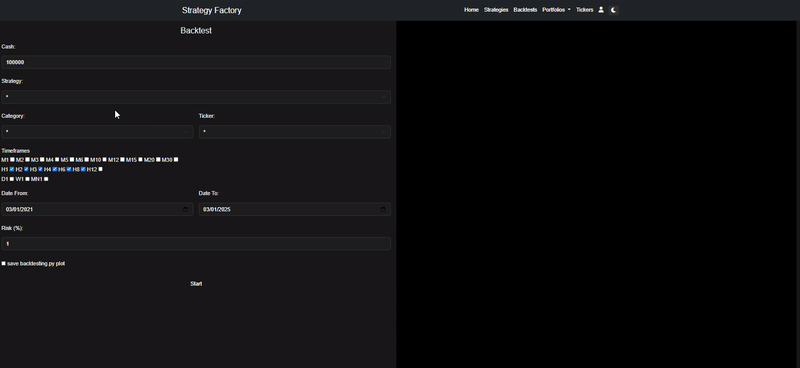

# Strategy Factory

**Strategy Factory** es una aplicación web diseñada para que puedas programar, testear y desplegar tus bots de trading de forma sencilla, ¡todo desde el navegador!
<p align="center">
  
</p>

## ¿Qué podés hacer con Strategy Factory?

### 🤖 Codificación de Estrategias de Trading
Programá tus estrategias directamente en el navegador, con herramientas visuales para analizar su comportamiento.

🔹 *Construida sobre [Backtesting.py](https://github.com/kernc/backtesting.py)* → Si ya usás esta librería, te va a resultar familiar.


### ⚡ Ejecución Masiva de Estrategias
Probá tus bots en múltiples tickers y timeframes de tu broker.



### 🧪 Testeo de Estrategias
Poné a prueba tu estrategia con estos tests:
 - Montecarlo
 -  Random Test 
 - Luck Test 
 - T-Test 
 - Correlation Test


### 🚀 Desplega tu bot
Pone tu bot a correr en tiempo real!


## ⚙️ Instalación

### Requisitos
- [Python 3.12.8](https://www.python.org/downloads/release/python-3128/)
- [MetaTrader5](https://www.metatrader5.com/es)

### Pasos
- Logearse con la cuenta de tu broker en MetaTrader5
- Crear y activar un entorno virtual
- Ejecutar python `python install_dependencies.py`
- Levantar app con python `python app/main.py`

## Notas y recomendaciones
- En algunos casos los brokers no tienen los nombres de los tickers de forma "pura" por ejemplo `EURUSD` -> `EURUSDm`. En estos casos es posible que la aplicacion falle.

- Hasta el momento Strategy Factory asume que la cuenta base sobre la que se realizan operaciones esta en **USD**.

- El core de la aplicacion esta desarrollado sobre la libreria de [Backtesting.py](https://github.com/kernc/backtesting.py)
, pero para implementar algunas funcionalidades extra se realizó un [fork](https://github.com/SaidJacobo/backtesting.py) del proyecto.

## Docs
📕 https://saidjacobo.github.io/strategy_factory_core/app/backbone.html

## Tutorial
📺 https://www.youtube.com/playlist?list=PLIS81qU4XbMc8n5pinieZsrb4K4hhutjw

## 🤝 Contribuir

¡Las contribuciones son bienvenidas y muy apreciadas! 🎉 Ya sea que quieras reportar un bug, sugerir una nueva funcionalidad, mejorar la documentación o enviar mejoras de código — ¡estás más que invitado/a a participar!

### ¿Cómo contribuir?

1. **Haz un fork de este repositorio** — Haz clic en el botón `Fork` arriba a la derecha.
2. **Clona tu fork**
```bash
git clone https://github.com/tu-usuario/strategy_factory.git
```
3. **Crea una nueva rama**
```bash
git checkout -b feature/nombre-de-tu-feature
```
4. **Realiza tus cambios**  
Corrige errores, agrega nuevas funcionalidades o mejoras.
5. **Haz commit de tus cambios**
```bash
git commit -m "Agrega: descripción de tu cambio"
```
6. **Sube los cambios a tu fork**
```bash
git push origin feature/nombre-de-tu-feature
```
7. **Abre un Pull Request** — Ve al repositorio original y haz clic en `New pull request`.

### Guías y buenas prácticas

- Sigue el estilo de código y la estructura existente.
- Escribe mensajes de commit claros y descriptivos.
- Si es posible, incluye tests para tus cambios.
- Documenta cualquier nueva funcionalidad o comportamiento.

### Discusiones e Issues

Si no sabes por dónde empezar, revisa la pestaña de [Issues](https://github.com/SaidJacobo/strategy_factory_core/issues) para ver errores abiertos o funcionalidades pendientes. También puedes iniciar una discusión si tienes ideas o preguntas.

---

## ⭐ Apoya el proyecto

Si este proyecto te resulta útil, considera dejarle una ⭐ en GitHub — ¡realmente ayuda mucho!

## Contact
📧 saidjacobo06@gmail.com
