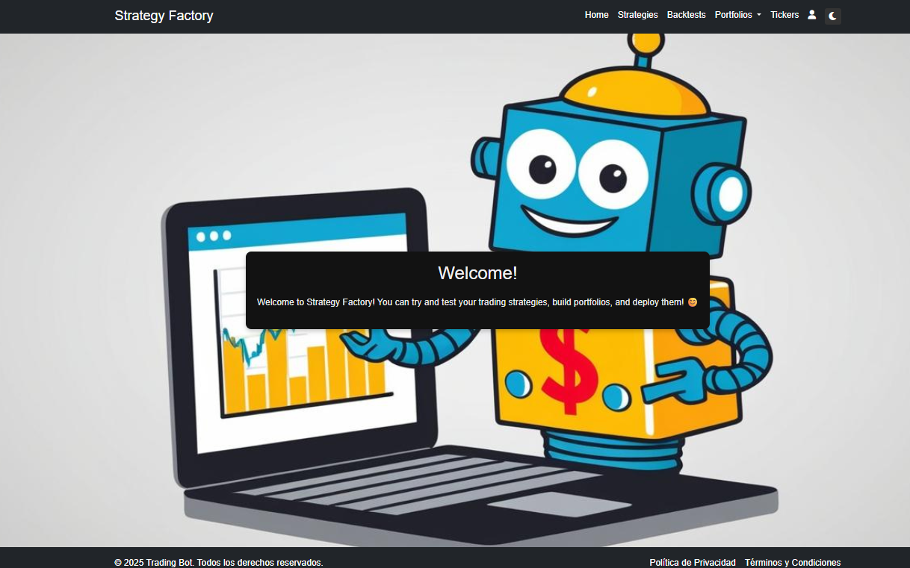

# Strategy Factory

**Strategy Factory** es una aplicación web diseñada para que puedas programar, testear y desplegar tus bots de trading de forma sencilla, ¡todo desde el navegador!

  

## ¿Qué podés hacer con Strategy Factory?

### 🤖 Codificación de Estrategias de Trading
Programá tus estrategias directamente en el navegador, con herramientas visuales para analizar su comportamiento.

🔹 *Construida sobre [Backtesting.py](https://github.com/kernc/backtesting.py)* → Si ya usás esta librería, te va a resultar familiar.

### ⚡ Ejecución Masiva de Estrategias
Probá tus bots en múltiples tickers y timeframes de tu broker.

### 🧪 Testeo de Estrategias
Poné a prueba tu estrategia con estos tests:
 - Montecarlo
 -  Random Test 
 - Luck Test 
 - T-Test 
 - Correlation Test

## ⚙️ Instalación

### Requisitos
- [Python 3.12.8](https://www.python.org/downloads/release/python-3128/)
- [MetaTrader5](https://www.metatrader5.com/es)

### Pasos
- Logearse con la cuenta de tu broker en MetaTrader5
- Crear y activar un entorno virtual
- Ejecutar python `python install_dependencies.py`
- Levantar app con python `python app/main.py`

## Notas y recomendaciones
- En algunos casos los brokers no tienen los nombres de los tickers de forma "pura" por ejemplo `EURUSD` -> `EURUSDm`. En estos casos es posible que la aplicacion falle.

- Hasta el momento Strategy Factory asume que la cuenta base sobre la que se realizan operaciones esta en **USD**.

- El core de la aplicacion esta desarrollado sobre la libreria de [Backtesting.py](https://github.com/kernc/backtesting.py)
, pero para implementar algunas funcionalidades extra se realizó un [fork](https://github.com/SaidJacobo/backtesting.py) del proyecto.

## Tutorial
📺 https://youtu.be/NqjJM60plJc

## Contact
📧 saidjacobo06@gmail.com
