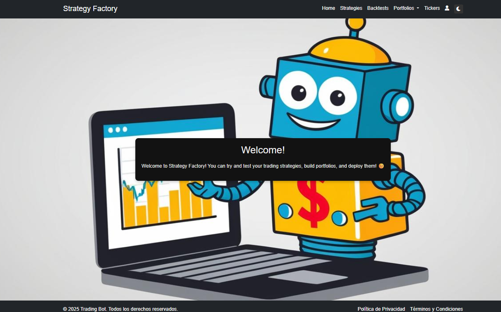
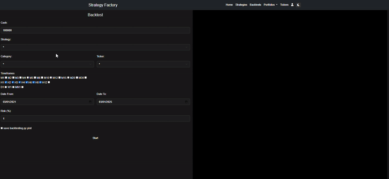
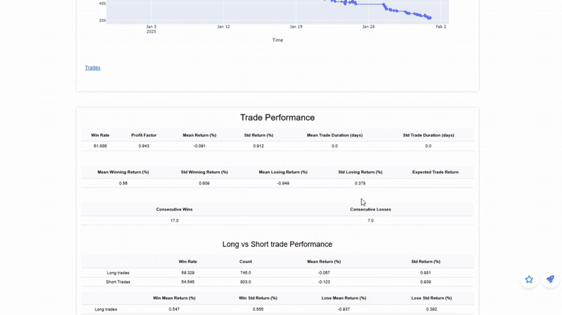

# Strategy Factory

**Strategy Factory** is a web application designed to let you code, test and deploy your trading bots easily — all from your browser!

  

## What can you do with Strategy Factory?

### 🤖 Trading Strategy Coding
Code your strategies directly in the browser, with visual tools to analyze their behavior.

🔹 *Built on top of [Backtesting.py](https://github.com/kernc/backtesting.py)* → If you already use this library, it will feel familiar.

### ⚡ Mass Strategy Execution
Run your bots across multiple tickers and timeframes from your broker.

### 🧪 Strategy Testing
Put your strategy to the test with the following methods:
 - Monte Carlo
 - Random Test
 - Luck Test
 - T-Test
 - Correlation Test

### 🚀 Deploy your bot
Put your bot to run in real time!

## ⚙️ Installation

### Requirements
- [Python 3.12.8](https://www.python.org/downloads/release/python-3128/)
- [MetaTrader5](https://www.metatrader5.com/en)

### Steps
- Log in with your broker account on MetaTrader5
- Create and activate a virtual environment
- Run `python install_dependencies.py`
- Launch the app with `python app/main.py`

## Notes and Recommendations
- In some cases, brokers don’t use "pure" ticker names (e.g., EURUSD might be EURUSDm). In such cases, the app might fail.

- Currently, Strategy Factory assumes the account base currency used for operations is **USD**.

- The core of the application is built on the [Backtesting.py](https://github.com/kernc/backtesting.py) library, but to implement some extra features, a [fork](https://github.com/SaidJacobo/backtesting.py) of the project was made.

## Docs
📕 https://saidjacobo.github.io/strategy_factory_core/app/backbone.html

## Tutorial (only in spanish)
📺 https://www.youtube.com/playlist?list=PLIS81qU4XbMc8n5pinieZsrb4K4hhutjw

## Contact
📧 saidjacobo06@gmail.com
